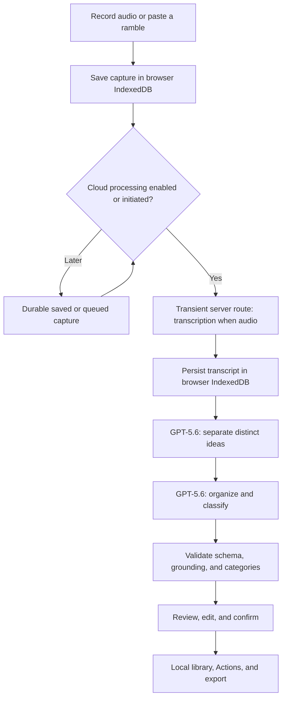

# Nugget

Nugget is a mobile-first voice capture PWA that turns an unstructured ramble into separate, editable ideas you can review, organize, and use later.

**OpenAI Build Week track: Apps for Your Life**

**Public demo:** [nugget-miner-kappa.vercel.app](https://nugget-miner-kappa.vercel.app) — production deployment `dpl_CZWcgTiGf3TaPyjfxDp59vg5zbqr`, READY and anonymously reachable. Its health endpoint reports transcription model `whisper-1` and organization model `gpt-5.6-terra`.

## The problem

Ideas captured while walking, commuting, or between tasks often become long voice notes. Later, finding the distinct projects, blockers, and next actions inside a ramble is slow and unreliable.

## What Nugget does

Nugget records audio or accepts pasted text, saves the capture in the browser, then—when cloud processing is enabled—transcribes audio only. Pasted text proceeds directly to idea separation and organization. Nugget then asks the person to review and confirm the result. Confirmed ideas are editable, searchable, filterable, actionable, and exportable.

## Try it

### Fast sample path

1. Open the [public production app](https://nugget-miner-kappa.vercel.app), or run Nugget locally.
2. In **Settings**, choose **Load sample library**.
3. Follow the two-minute [Judge Test Path](./docs/hackathon/JUDGING_TEST_PATH.md): search `community`, filter **Personal**, open the tool-sharing idea, complete its action, and export it.

The sample library adds three clearly labeled records only to the current browser. It does not call GPT-5.6, includes a sample transcript rather than a recording, and does not replace live capture.

### Live GPT path

1. On **Capture**, record a multi-idea ramble or paste text, then save it.
2. Choose **Process now** and enable cloud processing when prompted.
3. Nugget transcribes audio when needed, uses GPT-5.6 to separate and organize ideas, then opens the review flow.
4. Edit categories or tags as needed, confirm the ideas, and find them in **Ideas**.

Live processing sends audio for transcription and transcript text for GPT-5.6 organization only after the person enables or initiates cloud processing. [Judge Test Path](./docs/hackathon/JUDGING_TEST_PATH.md) has the complete walkthrough.

## Shipped core features

- One-tap browser recording with a pasted-text fallback; capture data is saved before cloud processing begins.
- Durable browser-local capture sessions, recordings, transcripts, processing state, ideas, categories, tags, and actions via IndexedDB.
- Resumable processing states with retry and duplicate-prevention safeguards.
- Zero-to-many independently editable ideas from one transcript, with source spans and `Explicit`, `Inferred`, or `Suggested` provenance.
- Required review before ideas enter the library; people can edit, discard, save drafts, or confirm ideas and suggested actions.
- Category descriptions, tags, local search and filters, idea detail, Actions, Markdown/JSON export, full local-data export, and local-data deletion.
- A clearly labeled local sample library for judge exploration, plus an installable PWA shell and offline capture path.

## GPT-5.6 usage

GPT-5.6 is the organization engine, not a chat add-on. The server-side client uses the Responses API with structured Zod output, configured reasoning effort, and `store: false`.

1. **Separation:** GPT-5.6 receives the transcript as untrusted data and identifies zero or more distinct, source-grounded idea candidates. Instructions inside a transcript are never followed as model instructions.
2. **Organization:** GPT-5.6 receives those candidates plus allowed category descriptions as untrusted data. It returns an editable record with a category, tags, goals, blockers, research needs, suggested actions, provenance, and source references.
3. **Validation:** Nugget validates structured responses, source spans, and allowed category IDs before writing reviewable records.

The committed [evaluation material](./docs/evals/README.md) tests canonical fixtures, schema and grounding safeguards, category validity, and duplicate-action behavior. The cost-incurring live suite is intentionally separate and remains an outstanding submission gate; no live report has been recorded yet.

## Architecture

Nugget stores the user’s durable records in browser IndexedDB. Server routes keep provider credentials server-side and relay processing transiently; they are not a user-content database. There are no accounts or cloud sync.



Processing can resume from durable state when the app is reopened and connected. Nugget does not guarantee processing while a mobile browser is fully closed.

## Built with Codex

Codex supported Build Week through a repository audit and sprint specification; architecture and migration implementation support; focused test and evaluation generation; code review and debugging; and deployment verification. The primary implementation work was coordinated sprint-by-sprint through the project-scoped Terra worker, with plans and evidence retained in this repository.

See the [Codex Build Week collaboration record](./docs/hackathon/CODEX_COLLABORATION.md) for dated commits, roles, human decisions, and verification examples. The primary implementation Session ID remains pending; no Session ID is inferred or substituted here.

## Human decisions

The human owner made the product and release decisions: prioritize an on-the-go, mobile-first capture experience; require people to confirm model proposals; use one category plus multiple tags with detailed category descriptions; apply the approved visual system; and make the final product judgment. The human also held scope on self-learning and live research, rejected accounts and sync for this MVP, chose focused risk-based verification over broad coverage targets, and retains deployment-release authority.

## Before and after Build Week

The [pre-Build-Week baseline](./docs/hackathon/PRE_HACKATHON_BASELINE.md) at `5394b9a` already had browser recording, local audio persistence, editable transcripts, consent-gated cloud routes, and a single-summary review slice.

Build Week added capture-session separation; zero-to-many rich ideas; GPT-5.6 Responses API segmentation and organization; durable processing and recovery; provenance and validation; categories, tags, library, Actions, export, PWA work, evaluation fixtures, E2E coverage, and the judge sample path. The dated [Build Week evidence ledger](./docs/hackathon/BUILD_WEEK_EVIDENCE.md) is the implementation record.

## Local setup

```powershell
git clone https://github.com/steven-d-pennington/nugget-miner.git
Set-Location nugget-miner
Copy-Item .env.example .env.local
npm ci
npm run dev
```

Open the local URL printed by Next.js. Real cloud processing requires a nonempty `OPENAI_API_KEY`; browsing loaded sample data does not.

## Environment variables

Start from [`.env.example`](./.env.example) and keep `.env.local` out of Git. [`docs/deployment/vercel-env.md`](./docs/deployment/vercel-env.md) explains the server-only configuration and Vercel handling.

| Variable | Purpose | Default when applicable |
| --- | --- | --- |
| `OPENAI_API_KEY` | Required secret for real cloud transcription and GPT-5.6 organization | none |
| `OPENAI_BASE_URL` | Shared OpenAI-compatible endpoint | `https://api.openai.com/v1` |
| `NUGGET_TRANSCRIPTION_BASE_URL` | Transcription endpoint override | `https://api.openai.com/v1` |
| `NUGGET_LLM_BASE_URL` | Organization endpoint override | `https://api.openai.com/v1` |
| `NUGGET_TRANSCRIPTION_MODEL` | Transcription model | `gpt-4o-mini-transcribe` |
| `NUGGET_LLM_MODEL` | Organization model | `gpt-5.6-terra` |
| `NUGGET_LLM_REASONING_EFFORT` | Organization reasoning effort | `medium` |
| `NUGGET_TRANSCRIPTION_MAX_BYTES` | Audio upload limit | `26214400` |
| `NUGGET_LLM_MAX_INPUT_CHARS` | Transcript input limit | `24000` |
| `NUGGET_TRANSCRIPTION_TIMEOUT_MS` / `NUGGET_LLM_TIMEOUT_MS` | Server request timeouts | `60000` / `90000` ms |

The verified production deployment reports overrides of `whisper-1` for transcription and `gpt-5.6-terra` for organization; do not infer encrypted environment values from this repository.

## Verification commands

```powershell
npm run typecheck
npm run lint
npm test
npm run build
npm run check
npm run test:e2e
npx vitest run src/lib/evals/scoring.test.ts
npm run eval:live
```

`npm run check` is the combined gate: it runs typecheck, lint, the normal test suite, and the production build. `npm run eval:live` is optional, cost-incurring, and requires a safely injected nonempty `OPENAI_API_KEY`; it is excluded from normal tests and CI. An authorized live run writes `docs/evals/latest.json`, but that file does not exist because the local evaluation process could not receive a safely injected nonempty `OPENAI_API_KEY`. The recorded-event live report remains an outstanding submission gate.

## Privacy and data handling

- Captures, recordings, transcripts, processing state, ideas, categories, tags, and actions persist in the browser’s IndexedDB database.
- The MVP has no account, cloud sync, or server-side user-content database.
- After a person enables or initiates cloud processing, audio is sent for transcription and transcript text is sent for GPT-5.6 organization through server routes. This processing is transient rather than browser-local persistence.
- Provider credentials remain server-side. Raw transcripts are treated as untrusted data; their embedded instructions cannot control the model workflow.
- People can inspect the processing mode, export local data, and delete local data. Do not use the sample library as evidence of real capture or cloud processing.

## Known MVP boundaries

- Public production is available without Vercel Authentication and passed anonymous root, health, security-header, manifest, and service-worker checks on July 16, 2026.
- The live evaluation report and a reusable live-result artifact are not yet recorded because the local evaluation process could not receive a safely injected nonempty `OPENAI_API_KEY`, despite authorization to make live OpenAI calls after deterministic checks within an approximate four-dollar ceiling.
- Physical-device microphone, secondary-browser, install/standalone, and mobile background/reopen verification remain incomplete.
- Nugget does not provide self-learning from corrections, live research, cloud sync, native apps, or guaranteed processing while a mobile browser is fully closed.

## Repository map and documentation

- [Documentation index](./docs/README.md)
- [Approved MVP specification](./docs/superpowers/specs/2026-07-15-nugget-mvp-hackathon-design.md)
- [Sprint program](./docs/superpowers/plans/2026-07-15-nugget-mvp-sprint-index.md) and [Sprint 6 submission plan](./docs/superpowers/plans/2026-07-15-nugget-mvp-sprint-6-submission.md)
- [Design brief](./docs/design/NUGGET_MVP_DESIGN_AGENT_BRIEF.md)
- [Judge Test Path](./docs/hackathon/JUDGING_TEST_PATH.md)
- [Build Week evidence ledger](./docs/hackathon/BUILD_WEEK_EVIDENCE.md)
- [Evaluation material and live-run status](./docs/evals/README.md)
- [Production smoke checklist](./docs/qa/production-smoke-checklist.md)
- [Deployment environment reference](./docs/deployment/vercel-env.md)

## License

Nugget is released under the [MIT License](./LICENSE).
